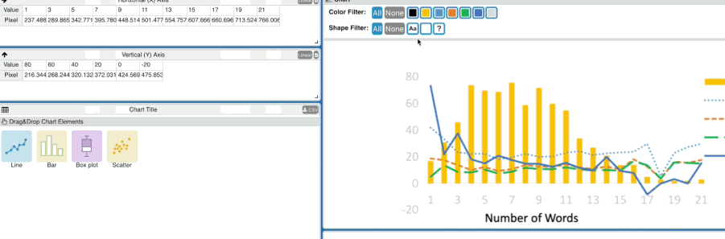

# ChartDetective
Source code of ChartDetective, a tool to extract the data represented by a vector chart. For more details, see the [accompanying paper](https://hal.science/hal-04017638v1/file/ChartDetective__CHI2023.pdf). 

## [> Try ChartDetective online <](https://m-damien.github.io/ChartDetective/home.html)


## Publication
> Damien Masson, Sylvain Malacria, Daniel Vogel, Edward Lank, and Géry Casiez. 2023. ChartDetective: Easy and Accurate Interactive Data Extraction from Complex Vector Charts. In Proceedings of the 2023 CHI Conference on Human Factors in Computing Systems (CHI '23). Association for Computing Machinery, New York, NY, USA, Article 147, 1–17.
[]( https://doi.org/10.1145/3544548.3581113)

## How to build & run
The tool was created using TypeScript and React. To run it, you can use npm.
In the project directory, first install all dependencies:
```
npm install .
```

Then run the project:
```
npm start
```


## How to use
You can find a step-by-step tutorial [here](https://m-damien.github.io/ChartDetective/home). In summary, the interface relies on drag-and-drop interactions: (1) select the chart you want to extract within an existing document; (2) select the X axis and then drag and drop it into the corresponding table. Same for the Y axis; (3) Select a mark (bar, line, dot, or boxplot) and drop it in the corresponding dropzone; (4) check the extraction by hovering over the data table or reviewing the reconstructed chart.

Note that the tool was tested and developped for recent versions of Google Chrome or Mozilla Firefox. By default, it should load a PDF with one page and to example charts. Feel free to try the tool on different PDFs or SVGs.


## Reporting Issues
PDFs can be weird and it is difficult to anticipate all cases. If you think you found a **vector** chart for which ChartDetective fails, feel free to report an issue with the PDF/SVG file attached. Or better yet, open a pull request: most issues with PDFs are due to the conversion from PDFs to individual shapes. The code responsible for this is in [/src/view/HookedCanvasFactory.tsx](/src/view/HookedCanvasFactory.tsx) and [/src/datastructure/ShapeCommand.tsx](/src/datastructure/ShapeCommand.tsx).